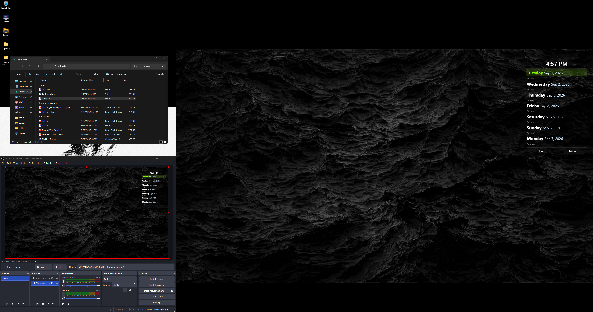
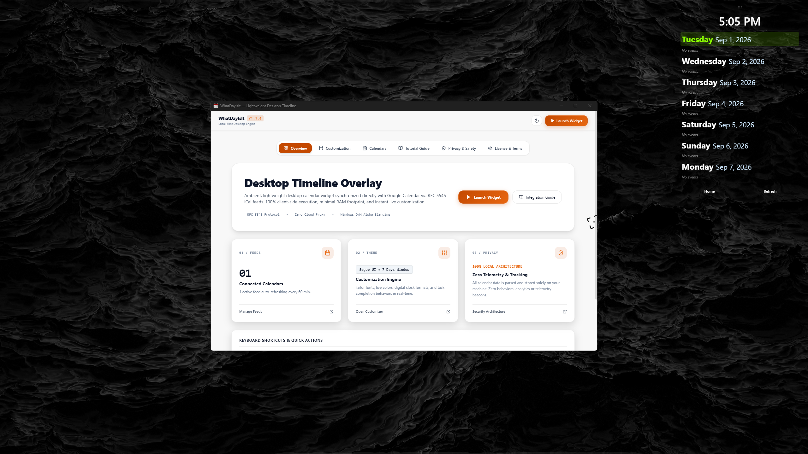
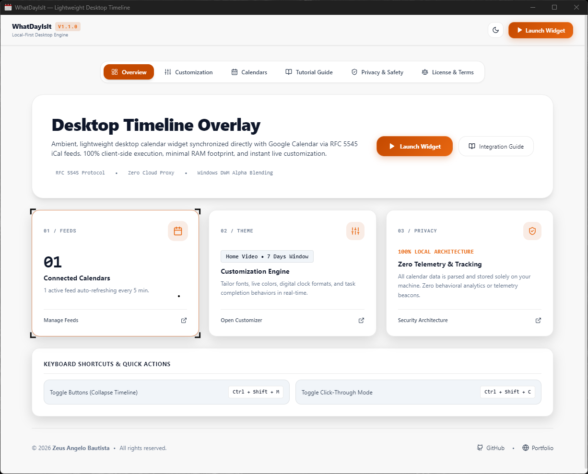
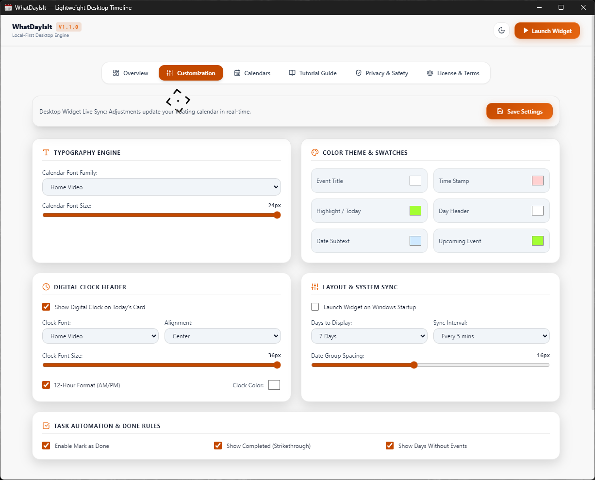
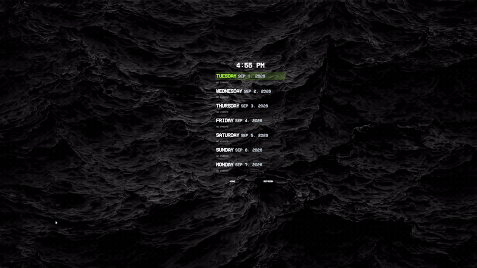
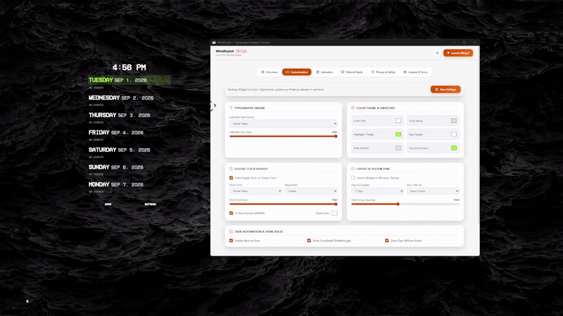
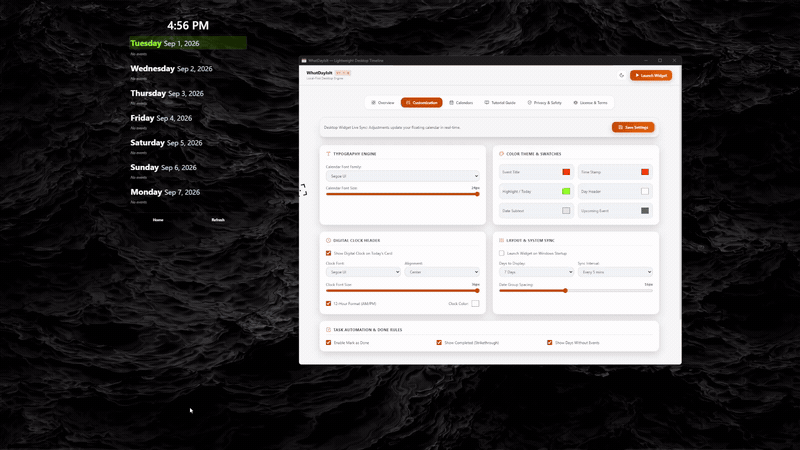

<div align="center">

# What Day is It?

**A lightweight, transparent desktop calendar overlay for Windows synchronized directly with Google Calendar.**

[](https://github.com/kidlatpogi/WhatDayIsIt/releases/latest)
[](https://github.com/kidlatpogi/WhatDayIsIt/releases/latest)
[](https://www.electronjs.org/)
[](https://react.dev/)
[](https://www.typescriptlang.org/)
[](LICENSE)

<br/>

[**Download Installer (.exe)**](https://github.com/kidlatpogi/WhatDayIsIt/releases/latest) • [**Why I Built This**](#-why-i-built-this) • [**Keybinds**](#%EF%B8%8F-keybinds) • [**Visual Showcase**](#visual-showcase) • [**Setup Guide**](#google-calendar-setup)

<br/>

<p align="center">
  
</p>

</div>

---

## 💡 Why I Built This

I often found myself **opening Google Calendar or checking my phone** just to see my next schedule.  
I wanted something that’s **always visible**, **minimal**, and **instantly accessible** — right on my desktop.  
That’s how this widget was born.

---

## Technical Overview

**What Day is It?** is an ambient, always-visible desktop overlay engineered to keep your upcoming schedule in sight without context switching. Designed with a **local-first privacy architecture**, all feed synchronization, RRULE recurrence expansion, and preferences are computed directly on your PC with a **sub-50MB RAM footprint**.

### Key Features

- **100% Local-First Privacy**: Connects directly to Google Calendar via HTTPS. Zero cloud relays, zero tracking telemetry, and zero behavioral analytics.
- **Hardware-Accelerated DirectComposition**: Native per-pixel alpha transparency on Windows DWM that launches instantly transparent on startup.
- **Persistent Desktop Positioning**: Intelligently remembers your custom window coordinates across monitors and restores exact screen placement upon relaunch.
- **RFC 5545 Recurrence Engine**: Comprehensive support for `VEVENT`, complex `RRULE` (daily, weekly, monthly, yearly), `EXDATE` exception rules, and multi-timezone offsets.
- **Real-Time Live Customization**: Modify typography, theme swatches, font sizes, clock formats, and day group spacing with immediate live reactivity on your desktop widget.
- **Fluid Drag & Click-Through**: Move freely across monitors using custom pointer capture, or activate click-through mode (<kbd>Ctrl</kbd>+<kbd>Shift</kbd>+<kbd>C</kbd>) to pass mouse clicks to background windows.
- **Dark & Light Mode Dashboard**: High-contrast theme engine featuring GSAP magnetic HUD bracket targeting cursor.
- **System Tray Operations**: Native Windows taskbar tray icon for background syncing, one-click window toggles, and instant preferences access.

---

## ⌨️ Keybinds

<div align="center">

| Shortcut | Action |
|:----------:|:----------------------------|
| <kbd>Ctrl</kbd> + <kbd>Shift</kbd> + <kbd>M</kbd> | Hide Buttons |
| <kbd>Ctrl</kbd> + <kbd>Shift</kbd> + <kbd>C</kbd> | Toggle Click-Through Mode |

</div>

---

## Visual Showcase

### Desktop Timeline & Management Dashboard
*Ambient transparent floating widget alongside the centralized control console.*

<p align="center">
  
</p>

---

### Landing & Overview Console
*Overview landing hub displaying connected feeds, active theme metrics, local privacy guarantee, and shortcut cheatsheet.*

<p align="center">
  
</p>

---

### Customization Engine
*Real-time typography controls, font size sliders, clock customization, and live color pickers.*

<p align="center">
  
</p>

---

### Interactive Demonstrations

<div align="center">

#### Window Dragging Across Multi-Monitors


<br/><br/>

#### Real-Time Customization Live Sync


<br/><br/>

#### Layout & Display Days Adjustment


</div>

---

## Google Calendar Setup

1. **Open Google Calendar**: Navigate to [Google Calendar Settings](https://calendar.google.com/calendar/r/settings).
2. **Select Calendar**: In the left sidebar under *"Settings for my calendars"*, click your desired calendar.
3. **Copy Secret Address**: Scroll down to the *"Integrate calendar"* section and copy the **"Secret address in iCal format"** (`.ics` URL).
4. **Add to Widget**: Open What Day is It?, go to the **Calendars** tab, paste the link, and click **Add Feed**.

---

## Project Architecture

```
Schedule-Widget-Electron/
├── assets/                               # Application icons, showcase media, fonts, and NSIS scripts
│   ├── Fonts/                            # Home Video & LED Dot-Matrix font assets
│   ├── calendar.ico                      # Application window & tray icon
│   ├── Calendar-Desktop-Example.png      # Desktop showcase screenshot
│   ├── Calendar-Desktop-Menu-Example.png # Dashboard & widget screenshot
│   ├── Overview.png                      # Overview console screenshot
│   ├── Customization.png                 # Customizer screenshot
│   ├── Dragging.gif                      # Dragging demo animation
│   ├── Customizing.gif                   # Customization demo animation
│   ├── Layout.gif                        # Layout sync demo animation
│   └── uninstaller.nsh                   # Custom NSIS registry and cleanup script
├── src/
│   ├── main/                             # Electron Main Process (Node.js runtime)
│   │   ├── index.ts                      # Lifecycle, single-instance lock, GPU flags
│   │   ├── window-manager.ts             # DirectComposition transparent window creation & position recall
│   │   ├── config-manager.ts             # Typed configuration & position persistence (%APPDATA%)
│   │   ├── ical-service.ts               # RFC 5545 parser, RRULE recurrence expansion, ETag cache
│   │   ├── tray-manager.ts               # Native Windows tray icon & context menus
│   │   └── ipc-handlers.ts               # Type-safe IPC channels & live broadcast
│   ├── preload/                          # Electron Preload Script (Context Bridge)
│   │   └── index.ts                      # Secure window.electronAPI exposed to renderer
│   ├── renderer/                         # React 18 + Tailwind CSS + Vite Frontend
│   │   ├── src/
│   │   │   ├── components/
│   │   │   │   ├── common/               # TargetCursor (GSAP magnetic bracket)
│   │   │   │   ├── home/                 # DashboardTab, SettingsTab, CalendarsTab, TutorialTab, PrivacyTab, LicenseTab, WelcomeModal
│   │   │   │   └── widget/               # WidgetView, ClockHeader, EventItem, WidgetControls
│   │   │   ├── hooks/                    # useConfig, useEvents
│   │   │   ├── utils/                    # Color conversion, date parsing, CSS variables
│   │   │   ├── App.tsx                   # View router (Main Widget vs Home Dashboard)
│   │   │   ├── main.tsx                  # React entry point
│   │   │   └── index.css                 # Design tokens, theme variables, scrollbars
│   │   └── index.html                    # Semantic HTML entry with SEO meta tags & CSP
│   └── types/                            # Shared TypeScript definitions (AppConfig, UIConfig, CalendarEvent)
├── package.json                          # Project scripts and dependencies
├── tsconfig.json                         # Renderer TypeScript configuration
├── tsconfig.electron.json                # Main & Preload TypeScript configuration
├── vite.config.ts                        # Vite bundler configuration
└── tailwind.config.js                    # Tailwind CSS theme configuration
```

---

## License

This project is licensed under the custom **MIT License with Attribution Requirement**.

```text
Copyright (c) 2026 Zeus Angelo Bautista

Permission is hereby granted, free of charge, to any person obtaining a copy
of this software and associated documentation files (the "Software"), to deal
in the Software without restriction, including without limitation the rights
to use, copy, modify, merge, publish, distribute, sublicense, and/or sell
copies of the Software, and to permit persons to whom the Software is
furnished to do so, subject to the following conditions:

1. The Software may not be sold or included in any commercial product or service
   without prior written permission.
2. If you modify, redistribute, or reuse any part of this Software, you must
   give clear credit to the original author: Zeus Angelo Bautista.
3. The above copyright notice and this permission notice shall be included
   in all copies or substantial portions of the Software.

THE SOFTWARE IS PROVIDED "AS IS", WITHOUT WARRANTY OF ANY KIND, EXPRESS OR
IMPLIED, INCLUDING BUT NOT LIMITED TO THE WARRANTIES OF MERCHANTABILITY,
FITNESS FOR A PARTICULAR PURPOSE AND NONINFRINGEMENT. IN NO EVENT SHALL THE
AUTHORS OR COPYRIGHT HOLDERS BE LIABLE FOR ANY CLAIM, DAMAGES OR OTHER
LIABILITY, WHETHER IN AN ACTION OF CONTRACT, TORT OR OTHERWISE, ARISING FROM,
OUT OF OR IN CONNECTION WITH THE SOFTWARE OR THE USE OR OTHER DEALINGS IN
THE SOFTWARE.
```

---

<div align="center">

Crafted by [**Zeus Angelo Bautista**](https://www.zeusbautista.site/)

</div>
